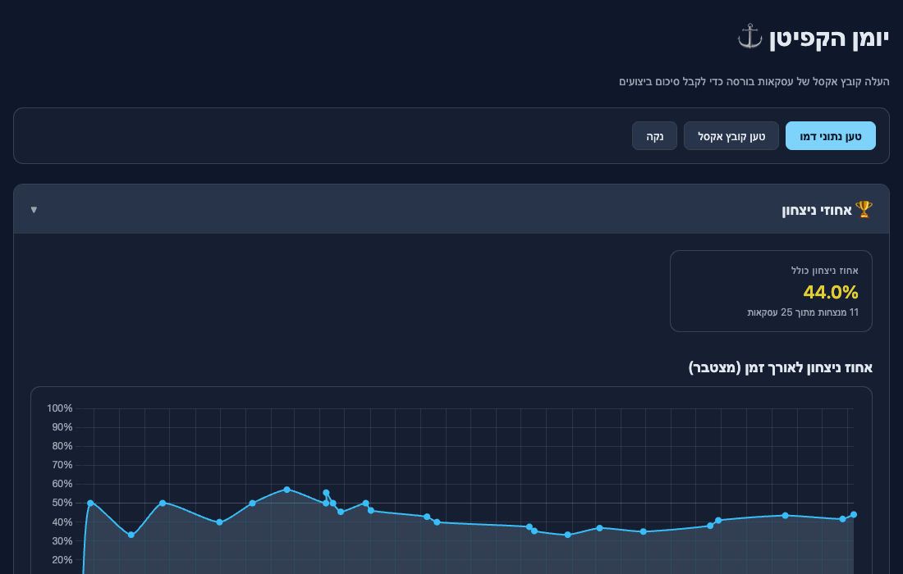

# Captin Log ⚓

A simple, single-file web app for analyzing your stock-market trades and getting a clear overview of your performance. Drop in an Excel export from your broker and immediately see your win rate, profit & loss broken down by currency, fees, dividends, and a per-trade P&L chart over time — no backend, no signup, everything runs in your browser.

**Live**: https://elados93.github.io/captin-log/

## Usage

- **Try it instantly** — click *טען נתוני דמו* to populate with random sample trades.
- **Load your own data** — click *טען קובץ אקסל* and select a broker export. Expected columns: `שם`, `סימבול`, `סוג פעולה`, `סכום כולל`, `עמלה`, `מטבע`, `תאריך`. Only `קניה בבורסה`, `מכירה בבורסה`, and `דיבידנד` rows are processed; everything else is ignored.

## Tech

Plain HTML + JS, [SheetJS](https://sheetjs.com/) for Excel parsing, [Chart.js](https://www.chartjs.org/) for visualizations. Hosted on GitHub Pages — every push to `master` redeploys.
